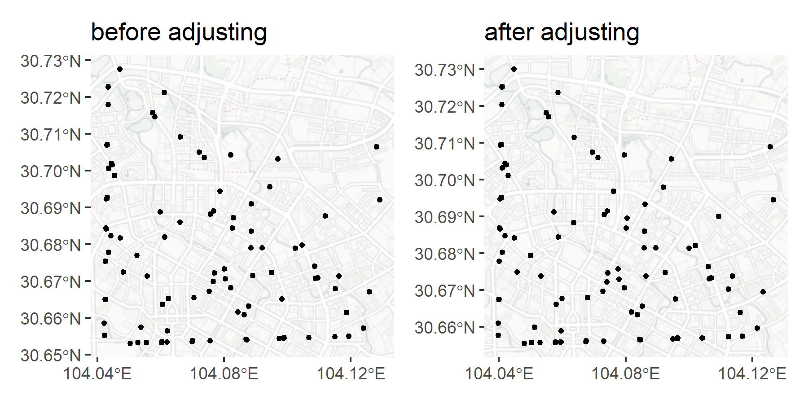
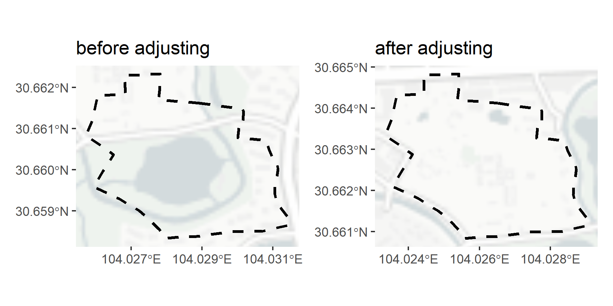

<!-- README.md is generated from README.Rmd. Please edit that file -->

# crsAdjustCN

<!-- badges: start -->

[](https://github.com/sToney239/crsAdjustCN/actions/workflows/R-CMD-check.yaml)
<!-- badges: end -->

`crsAdjustCN` is to transform between special coordinate systems in
China and WGS 84, especially for `sf` objects.

The main features of this package are:

- Some key functions implemented in C++, therefore could have better
  performance
- Specialization for transforming objects of the `sf` class.

## Installation

You can install the development version of crsAdjustCN from
[GitHub](https://github.com/sToney239/crsAdjustCN) with:

``` r
# install.packages("devtools")
devtools::install_github("sToney239/crsAdjustCN")
```

## Example

`st_crs_adjust()` is the core function in this package. You can provide
your `sf` class object to this function and get the coordinates adjusted
`sf` class object back.

``` r
chengdu = sf::read_sf("https://geo.datav.aliyun.com/areas_v3/bound/510100_full.json")
crsAdjustCN::st_crs_adjust(chengdu)
```

(Please note this function currently supports only the following
geometry types: `POINT`, `LINESTRING`, `POLYGON`, `MULTIPOINT`,
`MULTILINESTRING` and `MULTIPOLYGON`)

You can specify the `from` and `to` coordinates as arguments. Generally,
if the data is derived from Amap or Google Maps (within China), the
coordinates should be `gcj`. For data from Baidu Maps, the coordinates
should be `bd`. If the data comes from OpenStreetMap, the coordinates
should be `wgs` and require no adjustments.

------------------------------------------------------------------------

Here’s another example showing why you may need this coordinate
adjustment. The `example_car_trace` represents som sample points from
car trace with coordinates in `gcj02.` The figure demonstrates that,
without adjustment, the car trace log deviates from the roads, which
could not be right.

``` r
library(crsAdjustCN)
library(ggplot2)
rosm::register_tile_source(cartolight_nolabel = "http://a.basemaps.cartocdn.com/light_nolabels/${z}/${x}/${y}.png")
# example data
example_car_trace = data.frame(
  lon = c(104.04259,104.09895,104.06989,104.11875, 104.11199,104.05281,104.04718,104.10675,104.10259,
          104.05986,104.07533,104.06241,104.06202,104.12592,104.08017,104.05254,104.05819,104.08698,104.07674,104.06063,104.0432,
          104.1282,104.0886,104.08296,104.04358,104.08041,104.11506,104.04284,104.08634,104.04345,104.06618,104.04731,104.09897,
          104.04475,104.04231,104.08446,104.09505,104.08846,104.07657,104.04348,104.06209,104.04258,104.09211,104.04442,
          104.09708,104.05552,104.1195,104.0428,104.07698,104.08902,104.04319,104.12407,104.05383,104.11511,104.04268,104.09454,
          104.12924,104.08277,104.07561,104.06126,104.06113,104.07215,104.05571,104.04222,104.10462,104.09748,104.06201,
          104.07055,104.11632,104.0454,104.06033,104.06048,104.08782,104.04258,104.04346,104.10895,104.05043,104.08215,104.08212,
          104.10678,104.08868,104.04245,104.04823,104.07382,104.05746,104.07004,104.09889,104.04358,104.10868,104.04303,
          104.04434,104.0758,104.06208,104.09829,104.04289,104.06042,104.06624,104.1096,104.08728,104.07869),
  lat = c(30.66503,30.65456,30.65359,30.66149,30.68766,30.65325,30.72758,30.65461,30.67891,30.68876,
          30.66721,30.66524,30.65343,30.66711,30.67335,30.67699,30.71459,30.65421,30.68907,30.6637,30.70704,30.70651,30.68355,
          30.68715,30.70066,30.67058,30.6549,30.69232,30.66088,30.72272,30.68595,30.68175,30.65459,30.70155,30.65522,30.6616,
          30.67233,30.67908,30.66986,30.72274,30.65648,30.67539,30.67907,30.70196,30.70319,30.65327,30.65505,30.68427,
          30.67221,30.67145,30.69272,30.6572,30.65745,30.66788,30.68442,30.69558,30.69206,30.6844,30.65374,30.68198,30.72126,
          30.70503,30.67136,30.65853,30.67975,30.65434,30.65344,30.6655,30.67137,30.69862,30.65335,30.65345,30.66321,30.67539,
          30.7179,30.67068,30.65311,30.70428,30.66817,30.65459,30.69097,30.66504,30.67249,30.70352,30.71578,30.65379,30.65446,
          30.67778,30.67402,30.70695,30.68228,30.68812,30.65339,30.66519,30.68415,30.65349,30.70909,30.67092,30.65407,30.69442)
) |> sf::st_as_sf(coords = c("lon","lat"),crs = 4326)

# This step is for adjusting
example_adjusted = st_crs_adjust(example_car_trace, from = "gcj", to = "wgs")

# Plots for comparison
plot_before = ggplot()+
  ggspatial::annotation_map_tile(type = 'cartolight_nolabel',zoom = 12,progress ="none")+
  geom_sf(data = example_car_trace,color = 'black',size = 1)+
  labs(title = "before adjusting")+
  scale_x_continuous(breaks = c(104.04, 104.08,104.12))
plot_after = ggplot()+
  ggspatial::annotation_map_tile(type = 'cartolight_nolabel',zoom = 12,progress ="none")+
  geom_sf(data = example_adjusted,color = 'black',size = 1)+
  labs(title = "after adjusting")+
  scale_x_continuous(breaks = c(104.04, 104.08, 104.12))


patchwork::wrap_plots(list(plot_before,plot_after))
```



Another example is a museum extent downloaded from
[Amap](https://www.amap.com/), the coordinates used in this map is also
in `gcj02` coordinate system. As you can see, after adjusting, the
boundary of the museum fit to the surroundign better.

``` r
# example data
example_museum =data.frame(
  lon = c(104.028927,104.029536,104.030137,104.030167,104.030148,104.030056,104.030013,104.030116,104.030805,
          104.030901,104.031021,104.031118,104.031141,104.031059,104.031052,104.031079,104.031205,104.03144,104.031448,
          104.030694,104.029852,104.028847,104.028341,104.027983,104.027782,104.027484,104.02722,104.026924,104.026675,104.026397,
          104.025976,104.025951,104.026206,104.026504,104.026286,104.025729,104.02591,104.026054,104.026835,104.026814,
          104.027814,104.027813,104.027773,104.028927),
  lat = c(30.66162,30.661538,30.661479,30.661416,30.661128,30.661132,30.660775,30.660776,30.66071,30.660463,
          30.660247,30.660109,30.660012,30.659553,30.659403,30.659289,30.659078,30.658825,30.658648,30.658498,30.658491,
          30.658374,30.658359,30.658329,30.658561,30.658818,30.659004,30.659151,30.659287,30.659403,30.659569,30.659596,
          30.659964,30.660364,30.660507,30.660829,30.661202,30.661797,30.661843,30.662287,30.662323,30.661988,30.661698,30.66162)
) |> sfheaders::sf_polygon() |> sf::st_set_crs(4326) 


# This step is for adjusting
example2_adjusted = example_museum |> 
  st_crs_adjust(from = "gcj", to = "wgs")

# Plots for comparison
museum_before = ggplot()+
  ggspatial::annotation_map_tile(type = 'cartolight_nolabel',zoom = 14,progress ="none")+
  geom_sf(data = example_museum,fill = "transparent",color = 'black',linetype = 2,linewidth = 1)+
  labs(title = "before adjusting")+
  scale_x_continuous(breaks = c( 104.027,104.029,104.031))
museum_after =  ggplot()+
  ggspatial::annotation_map_tile(type = 'cartolight_nolabel',zoom = 14,progress ="none")+
  geom_sf(data = example_museum |> st_crs_adjust(),fill = "transparent",color = 'black',linetype = 2,linewidth = 1)+
  labs(title = "after adjusting")+
  scale_x_continuous(breaks = c(104.024, 104.026,104.028))

patchwork::wrap_plots(list(museum_before, museum_after))
```



As shown, after the adjustment, the museum’s boundary aligns more
accurately with the surrounding area.
